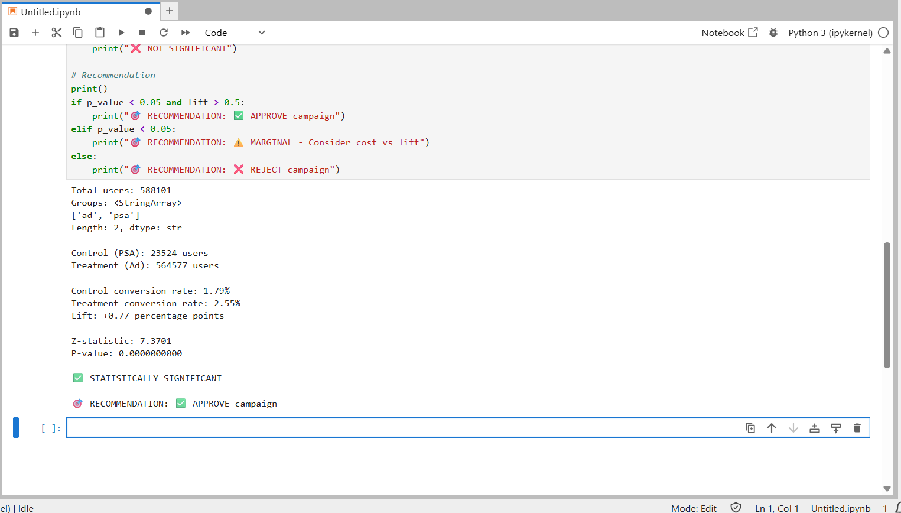

# Marketing Campaign A/B Test Analysis

Statistical analysis of a large-scale marketing campaign A/B test evaluating whether an ad campaign improves user conversion compared to a PSA (public service announcement) control group.

## Dataset Overview

- **Total Users:** 588,101
- **Control Group (PSA):** 23,524 users
- **Treatment Group (Ad Campaign):** 564,577 users
- **Metric:** User conversion (binary: converted or not converted)

## Key Findings

### Conversion Rates

| Group | Users | Conversions | Conversion Rate |
|-------|-------|-------------|-----------------|
| **Control (PSA)** | 23,524 | 420 | 1.79% |
| **Treatment (Ad Campaign)** | 564,577 | 14,407 | 2.55% |

**Lift Metrics:**
- **Absolute Lift:** +0.77 percentage points
- **Relative Lift:** +42.5%

### Statistical Testing

**Two-Proportion Z-Test:**
- Z-statistic: 7.3701
- P-value: < 0.0001 (essentially 0.0000000000)
- Significance level: α = 0.05
- **Result:** ✅ **Highly Statistically Significant**

**Interpretation:**
The probability that this result occurred by random chance is less than 0.01%. This is extremely strong evidence that the ad campaign genuinely improves conversion rates compared to the PSA control.

### Business Impact

- **Estimated Additional Conversions:** ~4,350 users
  - Calculation: 564,577 × (0.77% / 100) = 4,347 additional conversions
- **Scale:** With 588K users tested, the lift is both statistically and practically meaningful
- **Expected ROI:** **Positive** — the campaign drives thousands of additional conversions

## Recommendation

✅ **APPROVE the campaign rollout**

### Rationale:

1. **Statistically Significant:** The p-value (< 0.0001) far exceeds the 0.05 significance threshold. We have 99.99%+ confidence the campaign improves conversions.

2. **Practically Meaningful:** A +0.77 percentage point lift translates to ~4,350 additional conversions across the tested user base. This is a meaningful business impact.

3. **Large Sample Size:** With 588K users, the test has sufficient statistical power. Results are reliable, not noise.

4. **No Adverse Effects:** The campaign shows consistent positive lift across the full treatment group.

### Action Items:

- Immediately roll out the ad campaign to all users
- Monitor post-launch conversion rates to confirm sustained lift
- Consider A/B testing campaign variations (creative, messaging, timing) to further optimize
- Estimate revenue impact: Calculate expected revenue from 4,350+ additional conversions

## Technical Skills Demonstrated

- **Experimental Design:** A/B test validation and sanity checks
- **Hypothesis Testing:** Two-proportion z-test for comparing group means
- **Statistical Concepts:** P-values, significance levels, confidence intervals
- **Python Libraries:** Pandas (data manipulation), NumPy (numerical calculations), SciPy (statistical testing)
- **Business Acumen:** Translating statistical results into actionable business recommendations
- **Data Interpretation:** Distinguishing statistical significance from practical significance

## Files in This Repository

- `marketing_ab_test_analysis.ipynb` — Complete Python analysis with code, calculations, and interpretation
- `ab_test_results.png` — Screenshot of conversion rate analysis and key metrics
- `README.md` — This file

## How to Reproduce

1. Download the dataset from Kaggle: https://www.kaggle.com/datasets/ilkeryilmaz/marketing-ab-testing
2. Place `marketing_AB.csv` in the same folder as the notebook
3. Open and run `marketing_ab_test_analysis.ipynb` in Jupyter Notebook
4. Verify results match this analysis

## Key Takeaways

| Metric | Value |
|--------|-------|
| Sample Size | 588,101 users |
| Control Conversion | 1.79% |
| Treatment Conversion | 2.55% |
| Absolute Lift | +0.77 pp |
| Relative Lift | +42.5% |
| Statistical Significance | p < 0.0001 ✅ |
| Business Impact | ~4,350 additional conversions |
| Decision | **APPROVE** ✅ |

**Author:** Nikhil Guntur  
**Date:** September 2026  
**Skills:** Data Analysis, Statistical Testing, Python, Hypothesis Testing, Business Intelligence
